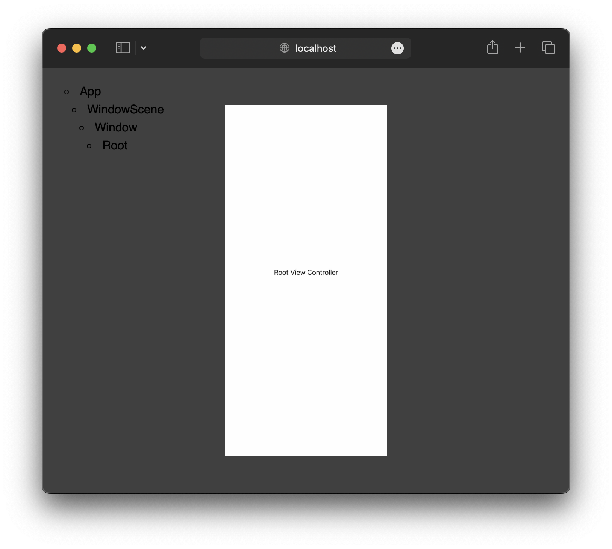

[](https://github.com/Tinder/Nodes-Tree-Visualizer/actions/workflows/swift.yml)
&nbsp;
[](https://github.com/Tinder/Nodes-Tree-Visualizer/actions/workflows/docc.yml)

# Nodes Tree Visualizer

A handy tree visualizer for apps using the [Nodes Architecture Framework](https://github.com/Tinder/Nodes)



## Minimum Requirements

- iOS `13.0`
- Swift `5.8`

## Installation

### Swift Package Collection

<details><summary>Expand / Collapse</summary><br>

```
https://swiftpackageindex.com/Tinder/collection.json
```

</details>

### Swift Package Manager

<details><summary>Expand / Collapse</summary><br>

**Package Dependency**

> Replace `<version>` with the desired minimum version.

```swift
.package(url: "https://github.com/Tinder/Nodes-Tree-Visualizer.git", from: "<version>")
```

**Target Dependency**

```swift
.product(name: "NodesSocketIO", package: "Nodes-Tree-Visualizer")
```

</details>

### Xcode

<details><summary>Expand / Collapse</summary><br>

**Package Dependency**

```
https://github.com/Tinder/Nodes-Tree-Visualizer.git
```

**Target Dependency**

```
NodesSocketIO
```

</details>

### Nodes Quick Start

> [!TIP]
> The following Git diff demonstrates how to install in a Nodes [Quick Start](https://github.com/Tinder/Nodes#quick-start) project. 

<details><summary>Expand / Collapse</summary><br>

```diff
diff --git a/project.yml b/project.yml
index 224200a..b303c0e 100644
--- a/project.yml
+++ b/project.yml
@@ -103,6 +103,9 @@ packages:
   Nodes:
     url: https://github.com/Tinder/Nodes.git
     version: 1.0.0
+  Nodes-Tree-Visualizer:
+    url: https://github.com/Tinder/Nodes-Tree-Visualizer.git
+    version: 1.0.0 # use the latest available version
   NeedleFoundation:
     url: https://github.com/uber/needle.git
     version: 0.25.1
@@ -120,6 +123,8 @@ targets:
     platform: iOS
     dependencies:
       - package: Nodes
+      - package: Nodes-Tree-Visualizer
+        product: NodesSocketIO
       - package: NeedleFoundation
     preBuildScripts:
       - name: Nodes
```

</details>

## Usage

Connect the socket when the app finishes launching to enable sending the necessary debug information to the web application.

```swift
import NodesSocketIO
```

```swift
#if DEBUG
private let debugSocket: DebugSocket<UIViewController> = .init()
#endif
```

```swift
#if DEBUG
debugSocket.connect()
#endif
```

### Nodes Quick Start

> [!TIP]
> The following Git diff demonstrates how to setup in a Nodes [Quick Start](https://github.com/Tinder/Nodes#quick-start) project. 

<details><summary>Expand / Collapse</summary><br>

```diff
diff --git a/Example/Sources/AppDelegate.swift b/Example/Sources/AppDelegate.swift
index 2de56d8..7cc009d 100644
--- a/Example/Sources/AppDelegate.swift
+++ b/Example/Sources/AppDelegate.swift
@@ -2,6 +2,7 @@
 //  Created by Tinder on 12/1/24.
 //
 
+import NodesSocketIO
 import UIKit
 
 @main
@@ -14,6 +15,10 @@ internal final class AppDelegate: UIResponder, UIApplicationDelegate {
 
     private lazy var appFlow: AppFlow = appBuilder.build()
 
+    #if DEBUG
+    private let debugSocket: DebugSocket<UIViewController> = .init()
+    #endif
+
     internal convenience init(appBuilder: AppBuilder) {
         self.init()
         self.appBuilder = appBuilder
@@ -33,6 +38,7 @@ internal final class AppDelegate: UIResponder, UIApplicationDelegate {
         else { return appFlow.start() }
         guard NSClassFromString("XCTestCase") == nil
         else { return }
+        debugSocket.connect()
         #endif
         registerProviderFactories()
         appFlow.start()
```

</details>

### Customization

<details><summary>Expand / Collapse</summary><br>

For non-UIKit apps or to customize the view rendering, provide a closure to the `DebugSocket` initializer.

```swift
let debugSocket: DebugSocket<UIViewController> = .init { viewController in
    let view: UIView = viewController.view
    let renderer: UIGraphicsImageRenderer = .init(bounds: view.bounds)
    let image: UIImage = renderer.image { view.layer.render(in: $0.cgContext) }
    return image.jpegData(compressionQuality: compressionQuality)
}
```

</details>

## Web Application

Use the local web server to view the tree.

### Dependency

```
brew install node
```

### Server

```
git clone git@github.com:Tinder/Nodes-Tree-Visualizer.git
cd Nodes-Tree-Visualizer
make serve
```

### Website

Copy and paste into browser:

```
http://localhost:3000
```

Open in browser from the command line:

```
open http://localhost:3000
```

## Contributing

While interest in contributing to this project is appreciated, it has been open 
sourced solely for the purpose of sharing with the community. This means we are 
unable to accept outside contributions at this time and pull requests will not 
be reviewed or merged. To report a security concern or vulnerability, please 
submit a GitHub issue.

## License

Licensed under the [Match Group Modified 3-Clause BSD License](
https://github.com/Tinder/Nodes-Tree-Visualizer/blob/main/LICENSE
).
